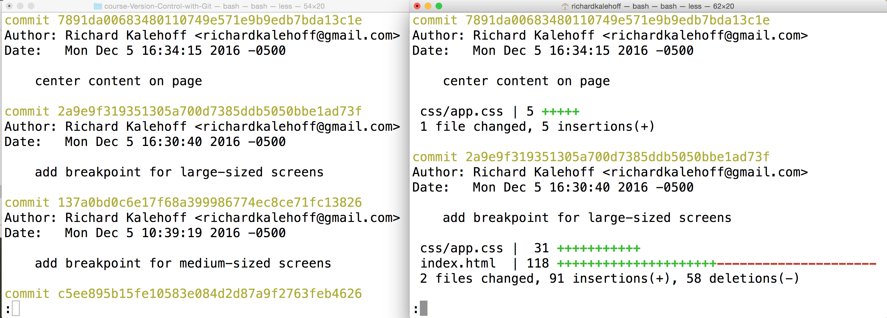
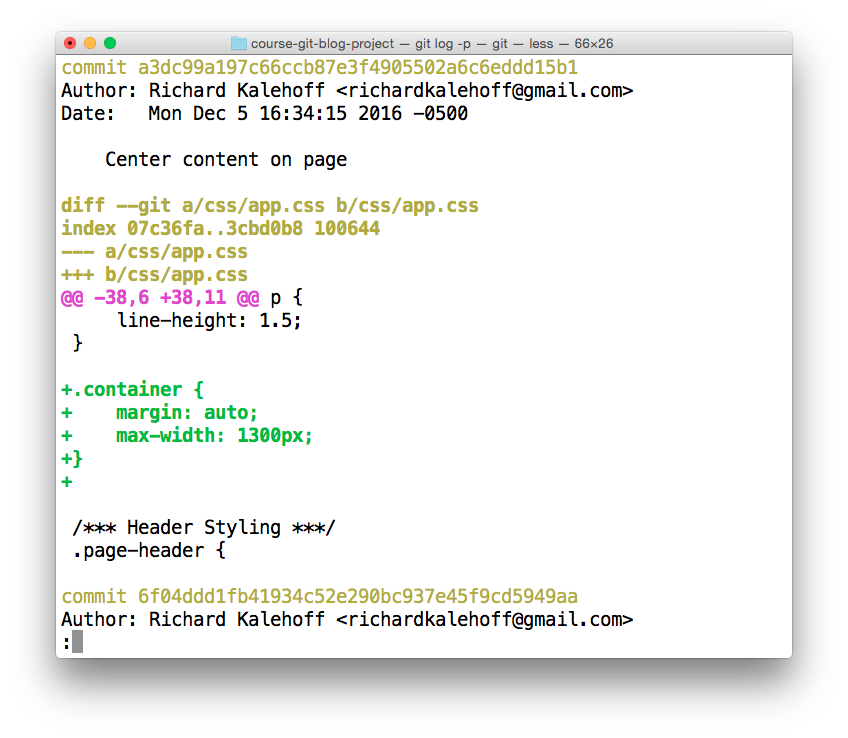
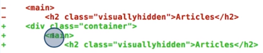

# 3. Viewing modified files
Created Saturday 07 November 2020

git log --stat
--------------

* In git, **git log** does not display which files changed in a commit.
* To know 'which' files that were changed, add the **--stat** option.

	git log --stat

* The + shows number of added lines, the - shows lines removed. 
* when --stat is used, statistics about the change are appended after the normal(git log) display, this is done for each file changed in a commit.
* stat is not shortened to -s

*****

git log -p
----------

* --stat shows stats about changes, but not the changes themselves. 
* To view changes, use the --patch (shortened is -p) for view the actual code change.

	git log --patch
	git log -p # exactly the same

* when -p is used the following is shown after the normal(git log) display:
	1. Name(of the file) before and after. - Git tracks renames.
	2. hash of the file before and after.
	3. Location(start line) of the change, and length.
	4. The actual change in code.
	* This done for each file in the commit.
* red lines (having a minus) are deletions. Green ones(with +) are additions.

*****

git log -p -w
-------------

* Git tracks edits by lines. A line is the __atomic__ change.

Here, main and h2 were was just indented by a tab. Git thinks of this as removal of the two lines and addition of two new lines.
i.e Change in whitespace in a line(i.e tabs/spaces) is akin to changing the line.

* This can be a pain, because indentation in most languages doesn't actually change the code.
* The problem can be solved by using **-w **flag

**Doubt**
Does Git keep track of newlines too, because that is also whitespace?
Depends. When newlines are created, some lines are pushed downwards. If these pushed lines had no whitespace change in them, they are not counted as a change. But the empty lines(added) are counted. This helps in keeping track of meaningful changes.
e.g
	#commit x
	A
	B
	C
	
	#commit x+1
	A
	 	#only this is counted as a change - even though it is empty
	B
	C

*****

**Combining stat and patch(aka p)**
-----------------------------------
All of these will show stats followed by patch, i.e all are equivalent

* git log -p --stat
* git log --stat -p
* git log --patch-with-stat

