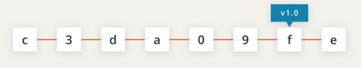

# 1. Tagging
Created Saturday 07 November 2020

* Suppose we do a major commit. To come back to this commit, we'd have to filter through all messages. Having a special indicator could help.
* Tagging in Git means to add something other than the message to a commit. This helps us single out major commits.

Our major commit is accessible more easily.

* Tagging is just an extra summary associated with a commit.

*****

**Commands**

* Add a tag to the latest commit

Just after committing. Use the git tag command.
	git commit -m "blah blah"
	git tag -a text_without_quotes #applies to the latest commit
	git tag -a text_without_quotes -m "tag message"
	

* Add tag to a specific commit - git tag also takes SHA as an argument

	git tag -a tag_text SHA_ID -m "message"
	

* To view all tags

	git tag # shows only tags, without SHA
	

* Delete tag from a commit

	git tag -d tag_text # this deletes any tag, not just the latest one
	git tag --delete tag_text # the same
	
Note:

* Doing git log or git show, will show the tag besides the SHA
* If -a is not used, the tag is said to be lightweight. -a tags can store date, author and a message. -a is short for annotate
* To replace a tag, you must delete the current tag.

