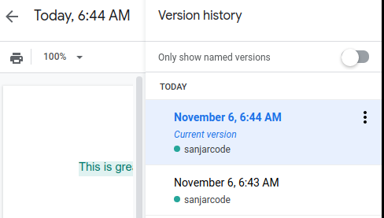

# 2. Motivation for a VCS
Created Friday 06 November 2020

Version control is built into file explorers and editors - they keep information such as created, last update and have temporary Redo/Undo actions, respectively. This is a very limited form of version control.

Google Docs/Drive has a more powerful version control

*****

This is not powerful enough - some important features are missing:

1. Labelling - Ability to label a change - currently it stores only time
2. Description - Ability to provide a description as to why/how the change was made
3. Change work version - Work on isolated copies of the current directory.
4. Selective choice of change - Ability to undo change A, edit B. Then get back change A without affecting edit B.

Git does all this, and more!!

