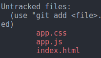
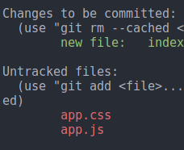

# 1. git add
Created Saturday 07 November 2020

Continuing(skippable)
---------------------

* If we do git status after creating some files. Git says the new files are untracked.

* Making a commit requires the files to be 'staged' first. The **``git add``** command is used to move files from the Working Directory to the Staging Index.

"Areas" in Git
--------------

* Git has 3 "areas" at any point in time:
	1. Working directory - files you can see/are working on.
	2. Staging area - to be saved.
	3. The repository - stores all the history snapshots. It is a passive area.
	* Note: Multiple files can be in any area.

* Simple way to remember - a photographer's 📷️ day, using a photofilm camera:
	* Working directory - pictures captured for the day.
	* Staging index - pictures that are good, "to be developed".
	* Repository - Pictures that "end up" in the album.

To sum up:

* There are 3 areas.
* Areas indicate the phase(time) of a file.
* Areas are unique - i.e. there's only one instance of them at all times.
* Only the repository stores the snapshots(commits).

Staging files - ``git add``
---------------------------

#### What is staging?

* Stage - move a copy selected file to the staging area.
* Obviously - only modified files are staged. Git ignores unchanged files.
* As only a copy is staged, you can keep working on the files.
* Only one copy(of a file) is kept in the staging area. Staging a file replaces the copy in the staging area, given it has been modified.

#### Syntax
	git add index.html #staging the file

#### Result

Terminology in the message:

* 'changes to be committed' refers to the files that have been staged but not committed yet.

Note:

* Repeating - Modifing/deleting a file in the working directory doesn't affect the staging area. You can safely commit.

Unstaging files
---------------

* You can unstage a file, from the staging area.
* Syntax: ``git rm --cached filename`` command. Clears the staging area.
* Unstaging files has no affect on the working directory. The staged files are lost.

Note: This can be prevented, using git reset.

**Notes:**

* git add can take multiple files as argument.
* To avoid verbosity, just do **git add .** to stage all files. A better option is 'git add -A', because it works even if you're not in the root directory.
* Staging is required for each commit, even if the same files were committed previously; the staging area is cleared after each commit.
* Any changes(edit, rename, delete) made to a file don't affect its copy in the staging area.

