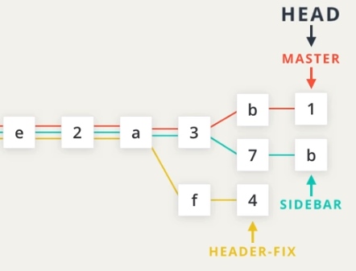
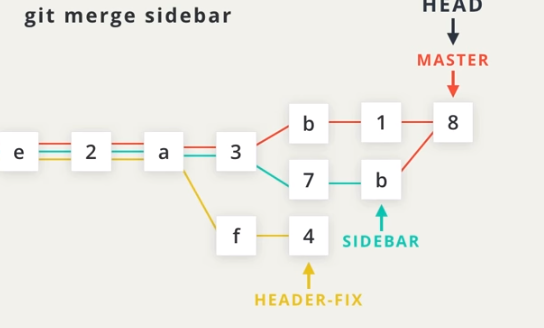
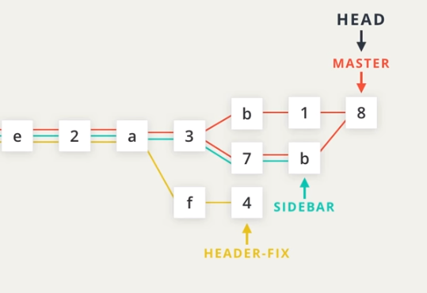
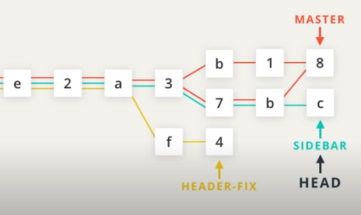
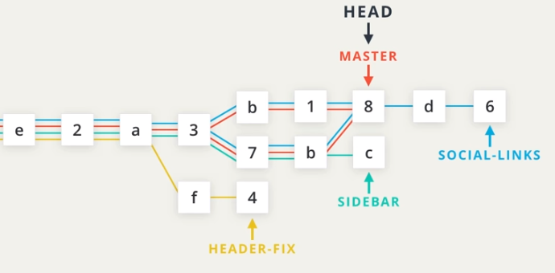
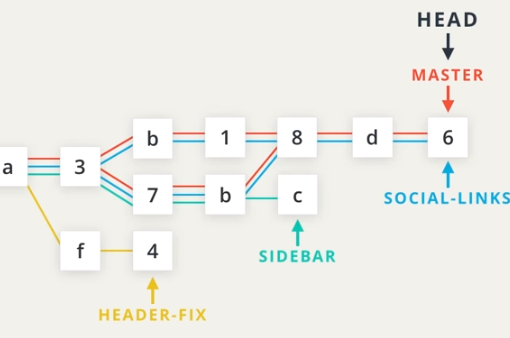

# 3. Merging
Created Sunday 08 November 2020

**Why merge?**
Suppose we have worked on multiple goals on our app, these could be contributions from team-mates. At the end of the project there can only be one package. To achieve this one package-ness, we need to somehow incorporate everyone's changes and make a single working directory of it, from which further development will proceed.

It's difficult to predict how this can be done, or can be done at all. 
Now, there are some cases when this is very easy, i.e if all changes happen to be on different files/lines. There are other cases where choosing the correct code is outright ambiguous, and human intervention becomes inevitable.

Git merge does **all** of the **unambiguous** cases automatically for us, but leaves some scope for manual intervention. These scenarios are called merge conflicts. 

*****

There are two types of merge:

1. Regular merge(just 'merge') - for two divergent branches.
2. Fast-forward merge - for two branches on the same line.

Regular Merge
-------------
Suppose we the following scenario.

* We want to 'merge' SIDEBAR and MASTER. The 'merge' operation is also a commit, so it has to be on some branch. Here we merge SIDEBAR into MASTER. i.e no new branch is created.

Only the active branch(the one with HEAD) changes. The other branch undergoes no change.
 

* Note, that after merging, we can access commits '7' and 'b' which are actually part of the sidebar branch, now as part of the master branch(red line - 37b8). This shows that a branch __doesn't need__ to be a single line all the way, it can have loops in it.

This is a **regular** **merge**.

* We can continue work on and make commits(c here) to the SIDEBAR, no problem.

Fast-forward Merge
------------------

* Let's say we make a new branch called SOCIAL-LINKS, which is a bit 'ahead' of the MASTER branch.

* Now we'd like to merge MASTER and SOCIAL-LINKS. And as MASTER is behind, it will move to the latest commit of the SOCIAL-LINKS branch.

Note that SOCIAL-LINKS and MASTER can still work independently, in the future.

This is called a fast-forward merge.

* No commit is made when a fast-forward merge is performed.

How to merge
------------

* Because the active branch becomes the recipient(of change), merge requires only one argument.

	git merge other_branch
		

* Since a normal merge is also a commit, a message can be supplied, but it is not necessary. A merge message is automatically generated if no message is given.
* To abort a merge, run this

	git merge --abort
	

When a merge fails?
-------------------
Git is able to automatically combine lots of work on different branches. 
However, there are times when it can't combine parts of branches together.
This situation is termed as a merge conflict.

