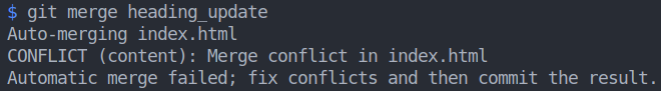
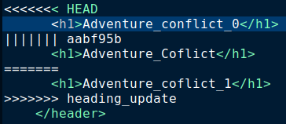
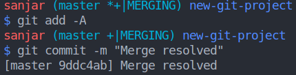

# 4. Merge conflicts
Created Sunday 08 November 2020

* The situation where a merge requires manual intervention, is termed as a merge conflict.
* When a merge conflict occurs, Git still merges the parts it can, leaving behind specially marked regions in the problematic files (e.g. >>> and <<<) that indicate locations which need manual fixing.
* If a merge is aborted, the marked regions are erased.

#### What causes a Merge Conflict
As we know, Git tracks lines in files. A merge conflict will happen when the same line(s) are changed in separate branches. 
Suppose for the same file(s) on different branches, we have print("hello") one line 97, and print("hello there") on line 97 on the other branch. There's no way for Git to decide which to keep.
We need to decide what to keep, and make the problematic lines same in both branches.

#### Create a Merge Conflict(for demo)

* Make a new branch.
* Change a line on a file in this new branch.
* Make sure the changes are committed in both branches.
* Switch to the original branch
* Run the merge command

#### Merge Conflict Indicator Explained

* **<<<<<<< ``current_branch``** - change to be made.
* **|||||||** - **``LEAST COMMON COMMIT``** SHA_ID. Most(branchwise) common code.
* **=======** - everything below this line (until the next indicator) shows you what's on the other branch(the merger).
* **>>>>>>> ``destination_branch`` **- Name of the merger branch. End of merge conflict indicator.

#### Resolve a merge conflict

* During a merge, there's only one branch receiving the change(from which merge is invoked). So merge conflict indicators appear only files of the 'mergee' branch. 
* Locate and remove all lines from the merge conflict indicator text.
* Decide what code to keep.
* Save, stage and commit(a message may be given).

**Merge is complete!**

e.g we have the following conflict indicator
	<<<<<<< HEAD
	      <h1>Adventure_conflict_0</h1>
	||||||| aabf95b
	      <h1>Adventure_Coflict</h1>
	=======
	      <h1>Adventure_coflict_1</h1>
	>>>>>>> heading_update

We get rid of the indicator messgage and write the code that we want
		<h1> Adventure Conflict Resolved</h1>

Note: If the indicators are not removed and we commit, Git doesn't give an error, as Git is not a syntax validator.

